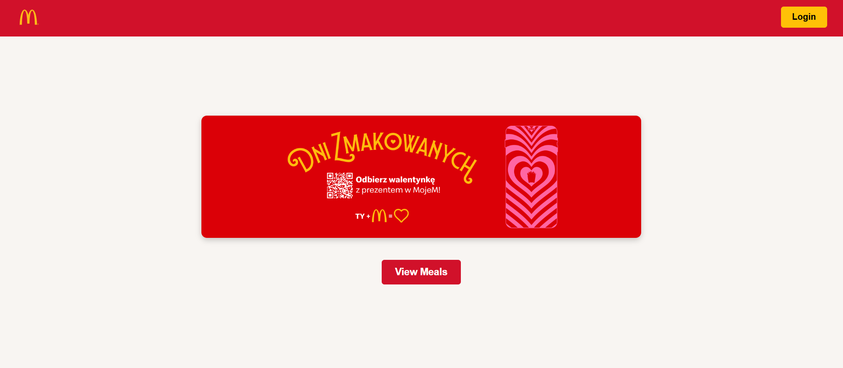
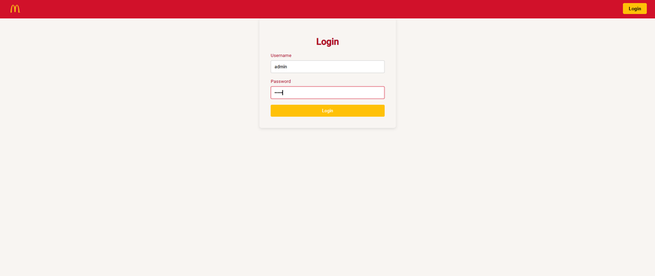
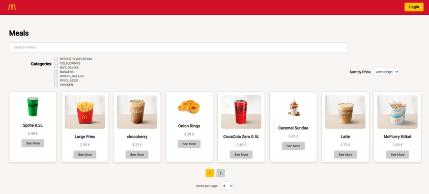
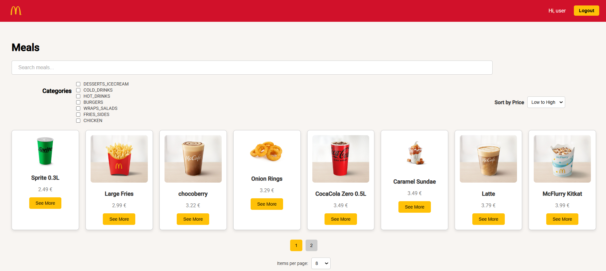
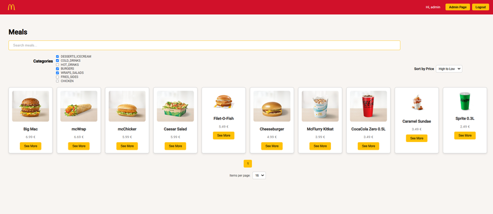
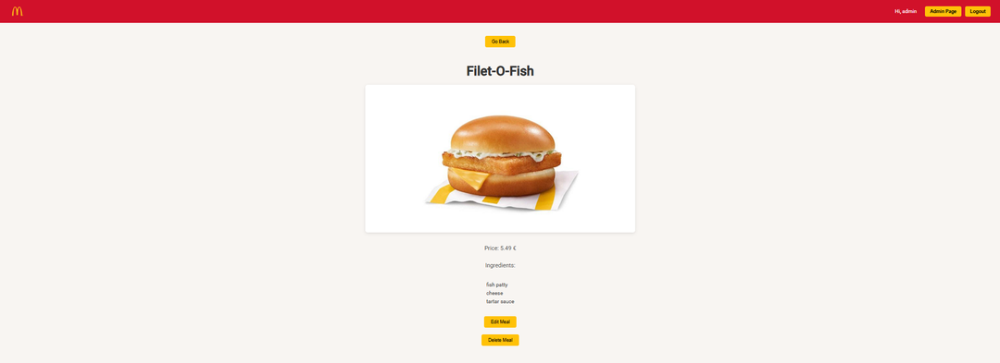
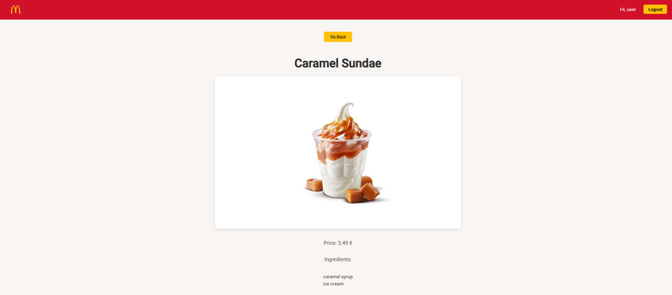
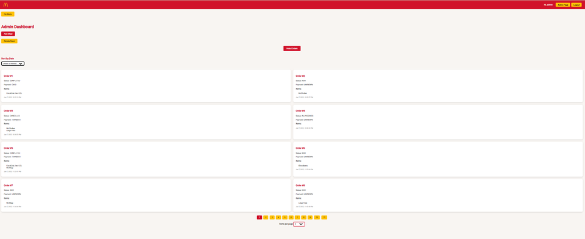
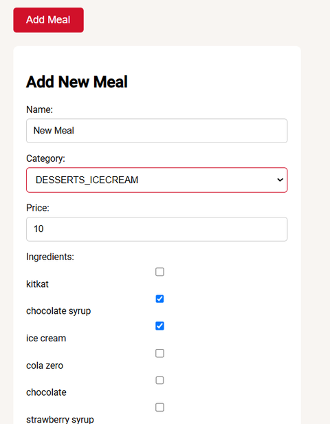
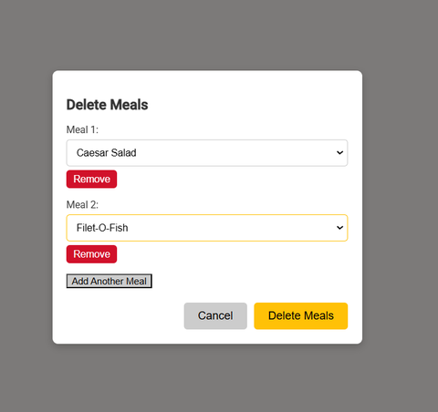

# Angular Kiosk

## Table of Contents
1. [Description](#description)
2. [Walkthrough](#walkthrough)
3. [Concepts Used](#concepts-used)
4. [Setup](#setup)

## Description
**Angular Kiosk** is a streamlined version of my other project, [McKiosk](https://github.com/mhermannn/McKiosk) — a website showcasing meals inspired by McDonald's. While it simplifies some features, it introduces a fully developed frontend built with **Angular 17, TypeScript, and SCSS**. The **Java backend** connects to a **PostgreSQL database**, managing data such as meals, ingredients, orders, and users.

## Concepts Used
In this project, I use concepts and technologies such as:
- **Pagination**: Allows users to navigate through meal and order lists efficiently.
- **Reactive Forms**: Enables dynamic and interactive form validation for login and meal management.
- **State Management**: Ensures smooth user experience and better data handling.
- **Authentication & Authorization**: Differentiates user and admin access.
- **Sorting & Filtering**: Enhances meal searchability with sorting options and category filtering.
- **Role-Based Access Control**: Restricts certain features based on user roles.
- **Validation & Error Handling**: Ensures data integrity and user guidance.
- **Responsive Design**: Provides a seamless experience across different devices.

## Walkthrough with Images

### 1. Welcome Page

The welcome page allows users to either log in or browse meals without logging in. While unauthenticated users can view and search for meals, they cannot access detailed meal information. Additionally, clicking on the advertisement redirects users to the relevant page on **mcdonald.pl**.

### 2. Login Page

Users can log in on this page. If incorrect credentials are entered, an error message prompts them to try again. Upon successful login, users receive a confirmation message and are redirected to the meals page with all available features unlocked.

There are two types of accounts:
- **User Account**: Limited access to certain features.
- **Admin Account**: Full access, including administrative functionalities.

### 3. Meals Page
#### When Not Logged In

Unauthenticated users can:
- Search for meals.
- Filter meals by category.
- Sort meals by name (A–Z, Z–A) or price (Low–High, High–Low).
- Select the number of results per page (4, 8, 16) and navigate through pages.

#### When Logged In as a User

Authenticated users can access all search and filtering options, along with the ability to view more details by clicking **See More**.

#### When Logged In as an Admin

Admins have all the features available to regular users, with additional access to the **Admin Page** via the navigation header.

### 4. Meal Page
#### When Logged In as an Admin

Admins can:
- View meal ingredients.
- Edit meal details.
- Delete individual meals.

#### When Logged In as a User

Regular users can view meal ingredients but cannot modify or delete meals.

### 5. Admin Page

Admins have access to:
- **Order Management**: View all previous orders, sort them by date (Oldest–Newest, Newest–Oldest), and paginate through them (4, 8, 16 orders per page).
- **Meal Management**:
  - **Adding Meals**: Requires valid input, including a minimum name length of 4 characters, choosing a meal category, a price between **0.01–99.99**, and at least one ingredient.
  - **Deleting Meals**: Supports batch deletion, ensuring no duplicate selections or placeholder options.

#### Admin Actions

Admins can add meals with real-time validation.

Admins can delete multiple meals at once, with validation preventing accidental duplicate selections.

## Setup
To set up this project, follow the **README files** located in the **backend** and **frontend** folders for detailed installation and configuration instructions.

---

Thank you for reading to the end! 😊
